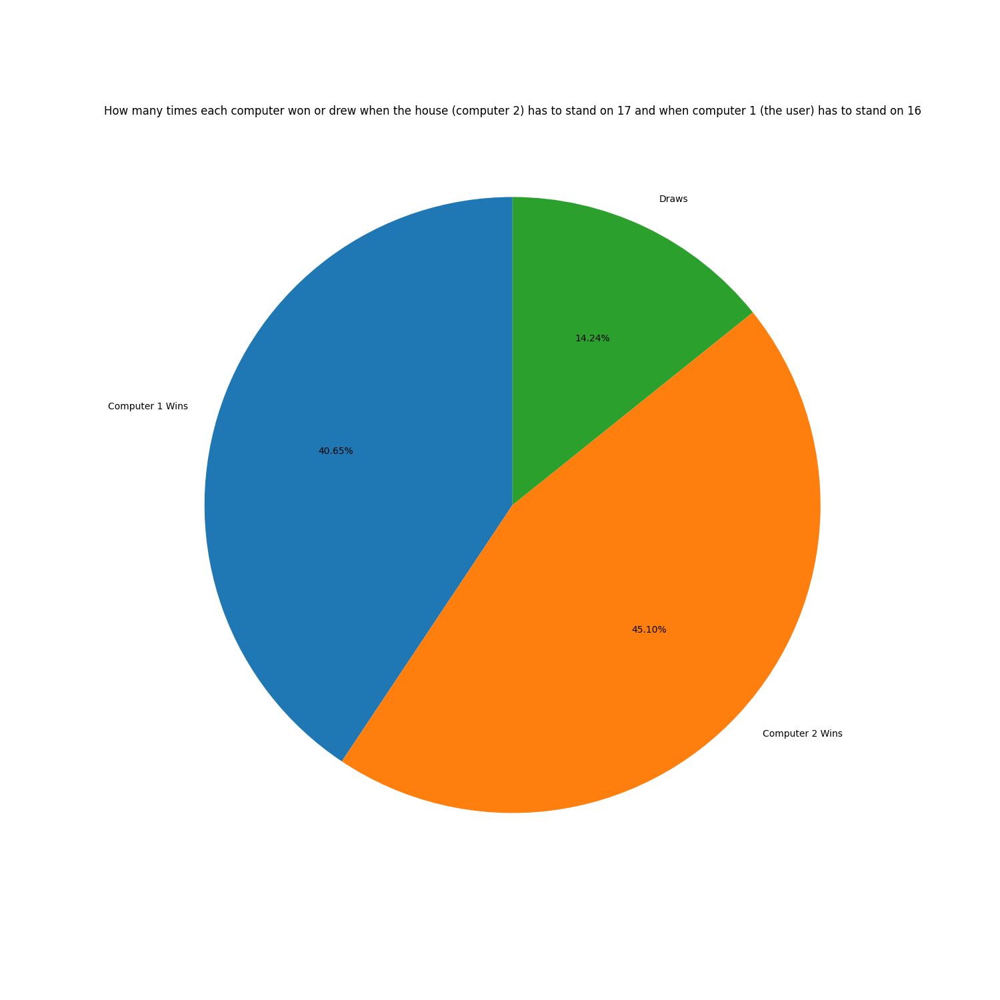

# Blackjack

I made this Python project for Leaving Certificate Computer Science in 2023. It has a single-player mode, a two-player mode and a simulation mode that compares different ways of playing.

## What it does

- **Single-player:** play against the computer and choose whether to take another card or stand.
- **Two-player:** two people play on the same computer.
- **Simulation:** run 100 games between two computer players. One stands at 16, and the other can be set to stand at 17 or 18.
- **Results:** save game scores to CSV files and create charts showing wins and draws.

I used Python for the game and simulation, CSV files to store results, and Matplotlib for the charts.

## Opening the project

Open the project folder in VS Code and open `LC.py`. You need Python, the VS Code Python extension and Matplotlib installed. The version of Matplotlib used for this project is listed in `requirements.txt`.

With a Python environment containing Matplotlib selected in VS Code, use **Run Python File** to start the game. The questions appear in the terminal panel at the bottom of VS Code. Type your answers there and press Enter.

This project does not have a separate graphical game window. If you get an error saying Matplotlib is missing, it needs to be installed in the Python environment VS Code is using.

## Playing

At the first question, type:

- `S` for single-player.
- `M` for two-player.
- `SIM` for the simulation.

In the game, answer `y` to take another card or `n` to stand. Follow the player prompts in two-player mode. When asked whether to play again, enter `n`, then `y` when asked to exit.

For the simulation, choose whether the second computer should stand at `17` or `18`. The next question asks about graphs: `y` creates charts and `n` runs without them. Both options run 100 games. Running without charts is quicker.

## Results and examples

The program saves results in these files:

- `Game_scores.csv` for single-player and two-player games.
- `Game_scores17.csv` for simulations with the second computer standing at 17.
- `Game_scores18.csv` for simulations with the second computer standing at 18.

New results are added to the existing files, so the totals can include more than one run. To start again, remove the results underneath the first row of the CSV file, keeping the headings.

Run the program with the project folder as the working folder so it uses these files. Generated charts are also saved there.

The `examples` folder contains saved results and charts from earlier runs. These are examples, so a new simulation will give different results.

## Things to improve

This is an old school project, and there are parts I would improve when revisiting it:

- Make the replay code simpler and save each result straight after a game.
- Generate the simulation charts once at the end instead of after every round.
- Keep each simulation run separate so the results are easier to compare.
- Check more unusual hands, such as hands containing several aces.

The game uses simplified rules. It picks card values randomly rather than keeping track of a full deck, and it does not include betting, splitting or doubling down.
